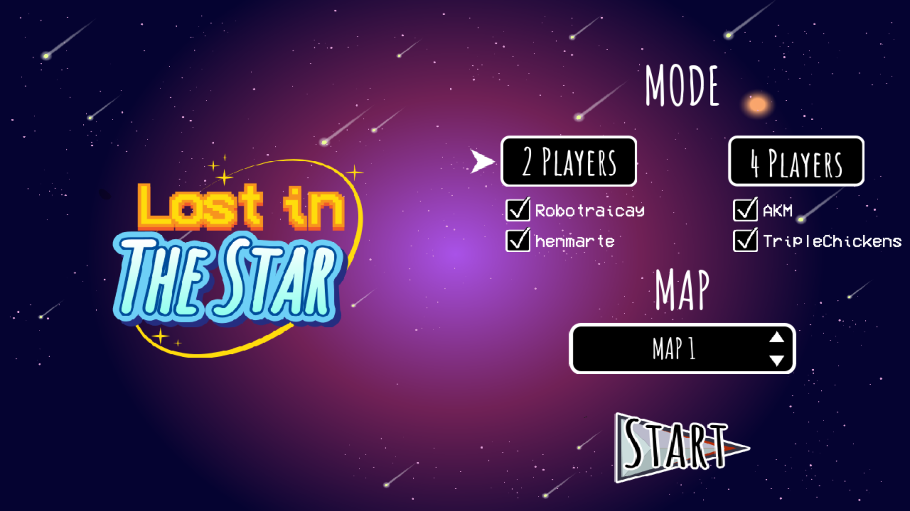

# Coding-Challenge-Game2-Lost In The Star
This is Game Lost In The Star - Game 2 of Final Round of Coding Challenge Competition in HCMUS-VNU (Ho Chi Minh University of Science). 

## Members
- Tuan-Viet Tran
- Nghia-Viet Hoang
- Nhat-Hung Dang Hoang

## Project Description
The game is coded in python3 using the multimedia library [pygame](https://www.pygame.org/news).

In this game, there are 2 or 4 teams lost in the star in the university. They are randomly reborned in a square matrix N x N with some cells are obstacles. To overcome the 
lost to comeback to their planet, they need to draw the color of cells by their own color: each team has their own color. In detail, team 1 has color red, team 2 has color green,
team 3 has color blue and the last team has color yellow.In one move, they can go to left, right, up or down without going to obstacle cells. 

Their tasks is to draw as much cell as they can to win the game in order to comeback to their planet.
This is interactive problem that the participant need to code a program to draw that cell with only map's information in each step. Good luck for the participant when enjoy this game!
  
## Getting Started
### Installing
* Clone the project to your computer. 
```
  git clone https://github.com/ttviet2805/Coding-Challenge-BombIT.git
```
* Set up Pygame Library:
```
  python3 -m pip install -U pygame --user
```

### Executing program
* Using an IDE to compile this game (Sublime Text 3, Visual Studio Code, ...)
* Remember to add all source codes to project before building and running
* Run file main.py to enjoy the Game

## Usage
* Game Menu Screen
<div align = "center">
  
</div>

* Game Screen
<div align = "center">
  
</div>

* Leaderboard Screen
<div align = "center">
  
</div>

## Contact
Tran Tuan Viet - ttviet2805@gmail.com
